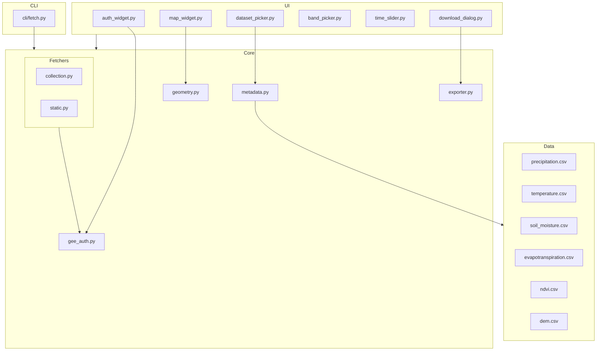

# GeoClimate-Fetcher

An open-source Python package and Jupyter Notebook GUI for downloading Google Earth Engine (GEE) climate data for user-defined study areas.

## Overview

GeoClimate-Fetcher enables researchers to easily access climate and geospatial data from Google Earth Engine without needing to write complex code. The package provides both an interactive GUI via Jupyter Notebooks and a command-line interface for headless servers.

## Key Features

- **Authentication Gate**: Secure access to Google Earth Engine with project ID authentication
- **Interactive Area of Interest**: Draw polygons directly on a map or upload shapefiles/GeoJSON
- **Extensive Dataset Catalog**: Search through 54+ climate datasets across multiple categories
- **Band Selection**: Choose specific bands from multi-band datasets
- **Temporal Filtering**: Select time ranges for time-series data
- **Multiple Export Options**: Download directly to local disk or export to Google Drive
- **Extraction Modes**: Average time-series or gridded raster outputs
- **Command-line Interface**: Automate downloads for headless servers

## Architecture



## Installation

### Using pip

```bash
pip install geoclimate-fetcher
```

### Development installation

```bash
git clone https://github.com/yourusername/geoclimate-fetcher.git
cd geoclimate-fetcher
pip install -e .
```

### Using conda

```bash
conda env create -f environment.yml
conda activate geoclimate-fetcher
```

## Quick Start

### Jupyter Notebook GUI

```python
# Launch the interactive notebook
jupyter notebook notebooks/interactive_gui.ipynb
```

### Command-line Usage

```bash
# Basic usage
geoclimate-fetcher --project-id YOUR_GEE_PROJECT_ID \
                   --geojson area.geojson \
                   --dataset-name "ERA5 Daily Aggregates" \
                   --bands total_precipitation \
                   --start-date 2021-01-01 \
                   --end-date 2021-01-31 \
                   --output-dir ./output

# List available datasets
geoclimate-fetcher --list-datasets

# Search for specific datasets
geoclimate-fetcher --search precipitation

# List bands for a dataset
geoclimate-fetcher --dataset-name "ERA5 Daily Aggregates" --list-bands
```

## Example Code

```python
from geoclimate_fetcher.core import (
    authenticate, MetadataCatalog, GeometryHandler, 
    GEEExporter, ImageCollectionFetcher
)

# Authenticate with GEE
auth = authenticate("your-project-id")

# Create a geometry for San Francisco Bay Area
geometry_handler = GeometryHandler()
sf_bbox = {
    "type": "Polygon",
    "coordinates": [[
        [-122.6, 37.2], [-122.6, 37.9], 
        [-121.8, 37.9], [-121.8, 37.2], 
        [-122.6, 37.2]
    ]]
}
geometry = geometry_handler.set_geometry_from_geojson(sf_bbox, "sf_bay_area")

# Find ERA5 precipitation dataset
catalog = MetadataCatalog()
dataset = catalog.get_dataset_by_name("ERA5 Daily Aggregates")
ee_id = dataset['Earth Engine ID']

# Download time series for January 2021
fetcher = ImageCollectionFetcher(ee_id, ["total_precipitation"], geometry)
fetcher.filter_dates("2021-01-01", "2021-01-31")
data = fetcher.get_time_series_average()

# Save to CSV
exporter = GEEExporter()
exporter.export_time_series_to_csv(data, "precipitation_data.csv")
```

## Available Datasets

GeoClimate-Fetcher includes catalogs for 54 datasets across 6 categories:

- **Precipitation** (11 datasets): ERA5, GLDAS, and others
- **Temperature** (10 datasets): MODIS LST, ERA5, and others
- **Soil Moisture** (8 datasets): SMAP, GLDAS, and others
- **Evapotranspiration** (17 datasets): TerraClimate, MODIS, and others
- **NDVI** (5 datasets): MODIS, Sentinel-2, and others
- **DEM** (3 datasets): SRTM, NASADEM, ALOS

## Dependencies

- earthengine-api >= 0.1.380
- geemap >= 0.28
- ipyleaflet >= 0.18
- ipywidgets >= 8
- pandas, xarray, geopandas
- rapidfuzz, tqdm, rich

## License

MIT

## Contributing

Contributions are welcome! Please feel free to submit a Pull Request.
